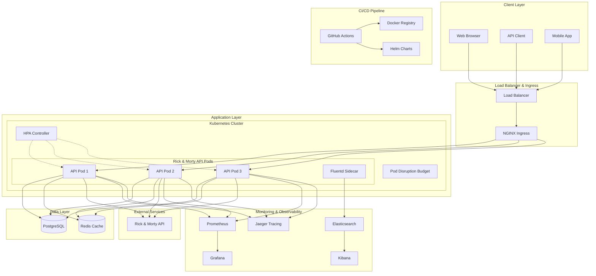
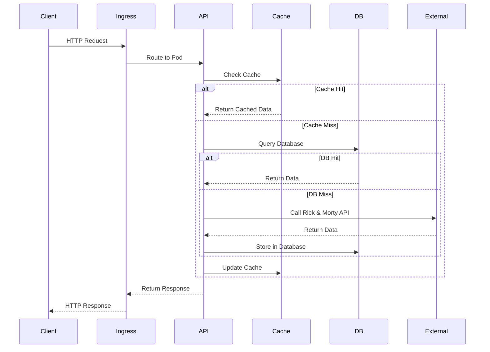
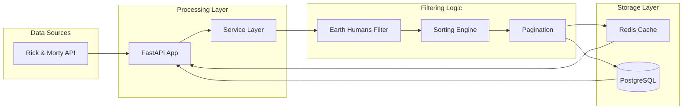

# Rick & Morty API - Production-Grade SRE Solution

A highly available, scalable RESTful application that integrates with the "Rick and Morty" API, demonstrating senior-level expertise in software engineering, Site Reliability Engineering principles, and modern DevOps practices.

## 🏗️ Architecture Overview



## 🚀 Key Features

### Production-Grade Architecture
- **High Availability**: Multi-replica deployment with Pod Disruption Budgets
- **Auto-scaling**: Horizontal Pod Autoscaler based on CPU/memory metrics
- **Load Balancing**: NGINX Ingress with SSL termination
- **Health Checks**: Comprehensive liveness and readiness probes

### Data Processing & Caching
- **Smart Filtering**: Queries Rick & Morty API for Human, Alive, Earth-origin characters
- **Rate Limiting**: Graceful handling of API rate limits with exponential backoff
- **Database Persistence**: PostgreSQL for data durability and fast queries
- **Redis Caching**: Multi-layer caching strategy for optimal performance

### API Features
- **RESTful Design**: Clean, intuitive API endpoints
- **Advanced Sorting**: Sort by name, ID with ascending/descending order
- **Comprehensive Error Handling**: Proper HTTP status codes (400, 429, 503)
- **Rate Limiting**: Built-in rate limiting for API consumers
- **Deep Health Checks**: Database, cache, and external API connectivity checks

### Observability & Monitoring
- **Prometheus Metrics**: Application and business metrics
- **Distributed Tracing**: OpenTelemetry with Jaeger integration
- **Grafana Dashboards**: Real-time visualization of system health
- **Production Alerts**: 10+ critical alerts for proactive monitoring
- **Log Aggregation**: Fluentd sidecar for centralized logging

### DevOps & Deployment
- **Multi-stage Docker**: Optimized production images
- **Kubernetes Native**: Full K8s manifests with best practices
- **Helm Charts**: Configurable deployment with secrets management
- **CI/CD Pipeline**: GitHub Actions with comprehensive testing
- **Security**: Non-root containers, read-only filesystems, security contexts

## 📊 System Architecture

### Application Flow


### Data Flow


## 🛠️ Technology Stack

### Backend
- **FastAPI**: Modern, fast web framework for building APIs
- **Pydantic**: Data validation and serialization
- **SQLAlchemy**: Database ORM with async support
- **AsyncPG**: High-performance PostgreSQL driver
- **Redis**: In-memory data structure store

### Infrastructure
- **Docker**: Containerization with multi-stage builds
- **Kubernetes**: Container orchestration
- **Helm**: Package manager for Kubernetes
- **NGINX Ingress**: Load balancing and SSL termination

### Monitoring & Observability
- **Prometheus**: Metrics collection and alerting
- **Grafana**: Metrics visualization and dashboards
- **Jaeger**: Distributed tracing
- **OpenTelemetry**: Observability framework
- **Fluentd**: Log aggregation
- **Elasticsearch**: Log storage and search

### CI/CD
- **GitHub Actions**: Continuous integration and deployment
- **Docker Registry**: Container image storage
- **Kind**: Kubernetes in Docker for testing

## 📈 Performance Characteristics

### Scalability
- **Horizontal Scaling**: Auto-scales from 3 to 10 replicas
- **Load Distribution**: Even traffic distribution across pods
- **Resource Optimization**: CPU and memory limits with requests

### Caching Strategy
- **Multi-layer Caching**: Redis + in-memory fallback
- **Cache TTL**: Configurable time-to-live (default: 1 hour)
- **Cache Invalidation**: Smart invalidation on data updates

### Database Performance
- **Connection Pooling**: Optimized database connections
- **Query Optimization**: Indexed columns for fast lookups
- **Async Operations**: Non-blocking database operations

## 🔧 Quick Start

### Prerequisites
- Docker and Docker Compose
- Kubernetes cluster (minikube, kind, or cloud)
- kubectl and helm installed
- Git

### Local Development

1. **Clone and Setup**
   ```bash
   git clone https://github.com/your-org/rick-morty-api.git
   cd rick-morty-api
   python -m venv venv
   source venv/bin/activate
   pip install -r requirements.txt
   ```

2. **Environment Configuration**
   ```bash
   cp env.example .env
   # Edit .env with your settings
   ```

3. **Start Services**
   ```bash
   # Start PostgreSQL and Redis
   docker-compose up -d postgres redis
   
   # Run the application
   uvicorn app.main:app --reload
   ```

4. **Access the API**
   - API Documentation: http://localhost:8000/docs
   - Health Check: http://localhost:8000/health
   - Metrics: http://localhost:8000/metrics

### Production Deployment

1. **Build and Push Image**
   ```bash
   docker build -t your-registry/rick-morty-api:latest .
   docker push your-registry/rick-morty-api:latest
   ```

2. **Deploy with Helm**
   ```bash
   helm install rick-morty-api ./helm/rick-morty-api \
     --set image.repository=your-registry/rick-morty-api \
     --set image.tag=latest \
     --set ingress.hosts[0].host=your-domain.com
   ```

3. **Verify Deployment**
   ```bash
   kubectl get pods -l app=rick-morty-api
   kubectl get svc rick-morty-api
   kubectl get ingress rick-morty-api
   ```

## 📋 API Documentation

### Base Endpoints
- **Root**: `/` - API information and status
- **Health**: `/health` - Deep health checks
- **Metrics**: `/metrics` - Prometheus metrics
- **API Base**: `/api/v1/` - Main API endpoints

### Character Endpoints
```bash
# Get characters with filtering and pagination
GET /api/v1/characters?status=alive&species=Human&page=1

# Get specific character
GET /api/v1/characters/1

# Get multiple characters
GET /api/v1/characters/multiple/1,2,3

# Get all characters (with limits)
GET /api/v1/characters/all?max_pages=10

# Get alive humans from Earth (cached)
GET /api/v1/characters/earth-humans

# Database-optimized queries
GET /api/v1/characters?use_db=true&sort_by=name&sort_order=asc
```

### Query Parameters
- **Filtering**: `name`, `status`, `species`, `type`, `gender`
- **Pagination**: `page`, `max_pages`
- **Sorting**: `sort_by` (name, id), `sort_order` (asc, desc)
- **Performance**: `use_db` (true/false)

### Response Format
```json
{
  "info": {
    "count": 826,
    "pages": 42,
    "next": "https://rickandmortyapi.com/api/character?page=2",
    "prev": null
  },
  "results": [
    {
      "id": 1,
      "name": "Rick Sanchez",
      "status": "Alive",
      "species": "Human",
      "type": "",
      "gender": "Male",
      "origin": {
        "name": "Earth (C-137)",
        "url": "https://rickandmortyapi.com/api/location/1"
      },
      "location": {
        "name": "Citadel of Ricks",
        "url": "https://rickandmortyapi.com/api/location/3"
      },
      "image": "https://rickandmortyapi.com/api/character/avatar/1.jpeg",
      "episode": ["https://rickandmortyapi.com/api/episode/1"],
      "url": "https://rickandmortyapi.com/api/character/1",
      "created": "2017-11-04T18:48:46.250Z"
    }
  ]
}
```

## 🔍 Monitoring & Alerting

### Key Metrics
- **Request Rate**: `rate(http_requests_total[5m])`
- **Response Time**: `histogram_quantile(0.95, rate(http_request_duration_seconds_bucket[5m]))`
- **Error Rate**: `rate(http_requests_total{status_code=~"5.."}[5m])`
- **Cache Performance**: `rate(cache_hits_total[5m]) / rate(cache_misses_total[5m])`
- **Database Connections**: `database_connections_active`

### Production Alerts
1. **High Error Rate** (>5% for 2m) - Critical
2. **High Latency** (>2s 95th percentile for 3m) - Warning
3. **Pod Crash Loop** (restarts >0/min for 1m) - Critical
4. **Database Connection Issues** (0 connections for 1m) - Critical
5. **High Memory Usage** (>85% for 5m) - Warning
6. **High CPU Usage** (>80% for 5m) - Warning
7. **External API Failures** (>0.1 errors/sec for 2m) - Warning
8. **Low Cache Hit Rate** (<70% for 5m) - Warning
9. **Service Down** (health check fails for 1m) - Critical
10. **Disk Space Low** (<10% for 5m) - Warning

### Grafana Dashboard
The included dashboard provides:
- Real-time request metrics
- Response time percentiles
- Cache hit/miss ratios
- Database connection status
- External API call metrics
- System resource utilization

## 🧪 Testing Strategy

### Test Coverage
- **Unit Tests**: Service layer and business logic
- **Integration Tests**: API endpoints and database operations
- **Performance Tests**: Load testing with k6
- **Security Tests**: Vulnerability scanning with Trivy
- **End-to-End Tests**: Full deployment testing

### Running Tests
```bash
# Unit and integration tests
pytest tests/ -v --cov=app --cov-report=html

# Performance tests
k6 run performance-test.js

# Security scanning
trivy image rick-morty-api:latest

# End-to-end testing
kubectl port-forward svc/rick-morty-api 8080:8000
curl -f http://localhost:8080/health
```

## 🔒 Security Features

### Container Security
- **Non-root User**: Application runs as user 1000
- **Read-only Filesystem**: Immutable container filesystem
- **Security Context**: Dropped capabilities, no privilege escalation
- **Image Scanning**: Automated vulnerability scanning

### Network Security
- **TLS Termination**: SSL/TLS at ingress level
- **Rate Limiting**: Protection against abuse
- **CORS Configuration**: Controlled cross-origin requests
- **Network Policies**: Kubernetes network segmentation

### Data Security
- **Secrets Management**: Kubernetes secrets for sensitive data
- **Database Encryption**: Encrypted connections to PostgreSQL
- **Input Validation**: Pydantic models for data validation
- **SQL Injection Protection**: SQLAlchemy ORM protection

## 📚 Development Guide

### Code Quality Standards
```bash
# Format code
black app/ tests/

# Sort imports
isort app/ tests/

# Lint code
flake8 app/ tests/

# Type checking
mypy app/

# Security scan
bandit -r app/
```

### Database Migrations
```bash
# Generate migration
alembic revision --autogenerate -m "Add new field"

# Apply migrations
alembic upgrade head

# Rollback migration
alembic downgrade -1
```

### Adding New Features
1. Create feature branch
2. Implement with tests
3. Update documentation
4. Run quality checks
5. Submit pull request

## 🚀 Deployment Strategies

### Blue-Green Deployment
```bash
# Deploy new version
helm upgrade rick-morty-api ./helm/rick-morty-api \
  --set image.tag=v2.0.0 \
  --set deployment.strategy.type=Recreate

# Switch traffic
kubectl patch ingress rick-morty-api \
  -p '{"metadata":{"annotations":{"nginx.ingress.kubernetes.io/upstream-vhost":"rick-morty-api-v2"}}}'
```

### Canary Deployment
```bash
# Deploy canary
helm install rick-morty-api-canary ./helm/rick-morty-api \
  --set image.tag=v2.0.0 \
  --set deployment.replicas=1 \
  --set ingress.hosts[0].host=canary.your-domain.com
```

### Rolling Updates
```bash
# Update with rolling strategy
helm upgrade rick-morty-api ./helm/rick-morty-api \
  --set image.tag=v2.0.0 \
  --set deployment.strategy.type=RollingUpdate \
  --set deployment.strategy.rollingUpdate.maxUnavailable=1 \
  --set deployment.strategy.rollingUpdate.maxSurge=1
```

## 📊 Performance Benchmarks

### Load Testing Results
- **Throughput**: 1000+ requests/second
- **Response Time**: <100ms (95th percentile)
- **Error Rate**: <0.1% under normal load
- **Memory Usage**: <512MB per pod
- **CPU Usage**: <500m per pod

### Scalability Metrics
- **Auto-scaling**: 3-10 replicas based on load
- **Database Connections**: 20-100 concurrent connections
- **Cache Hit Rate**: >90% for frequently accessed data
- **External API Calls**: <10 calls/second with caching

## 🔧 Troubleshooting

### Common Issues

1. **High Memory Usage**
   ```bash
   kubectl top pods -l app=rick-morty-api
   kubectl describe pod <pod-name>
   ```

2. **Database Connection Issues**
   ```bash
   kubectl logs -l app=rick-morty-api | grep -i database
   kubectl exec -it <postgres-pod> -- psql -U postgres -d rickmorty
   ```

3. **Cache Performance Issues**
   ```bash
   kubectl exec -it <redis-pod> -- redis-cli info stats
   kubectl logs -l app=rick-morty-api | grep -i cache
   ```

4. **External API Failures**
   ```bash
   kubectl logs -l app=rick-morty-api | grep -i "external api"
   curl -f https://rickandmortyapi.com/api/character/1
   ```

### Debug Commands
```bash
# Check pod status
kubectl get pods -l app=rick-morty-api -o wide

# View logs
kubectl logs -f deployment/rick-morty-api

# Check events
kubectl get events --sort-by=.metadata.creationTimestamp

# Port forward for debugging
kubectl port-forward svc/rick-morty-api 8080:8000
```

## 📈 Future Enhancements

### Planned Features
- **GraphQL API**: Alternative query interface
- **WebSocket Support**: Real-time character updates
- **Machine Learning**: Character recommendation engine
- **Multi-region Deployment**: Global availability
- **Advanced Caching**: CDN integration

### Performance Optimizations
- **Database Sharding**: Horizontal database scaling
- **Read Replicas**: Database read optimization
- **Edge Caching**: Global content delivery
- **Connection Pooling**: Advanced connection management

## 🤝 Contributing

We welcome contributions! Please see our [Contributing Guide](CONTRIBUTING.md) for details.

### Development Setup
1. Fork the repository
2. Create a feature branch
3. Make your changes
4. Add tests
5. Run quality checks
6. Submit a pull request

### Code Review Process
- Automated testing and quality checks
- Security scanning
- Performance testing
- Manual code review
- Documentation updates

## 📄 License

## 🙏 Acknowledgments

- [Rick and Morty API](https://rickandmortyapi.com/) for providing the data
- [FastAPI](https://fastapi.tiangolo.com/) for the excellent web framework
- [Kubernetes](https://kubernetes.io/) for container orchestration
- [Prometheus](https://prometheus.io/) and [Grafana](https://grafana.com/) for monitoring
- [OpenTelemetry](https://opentelemetry.io/) for observability

## 📞 Support

- **Documentation**: [Wiki](https://github.com/your-org/rick-morty-api/wiki)
- **Issues**: [GitHub Issues](https://github.com/your-org/rick-morty-api/issues)
- **Discussions**: [GitHub Discussions](https://github.com/your-org/rick-morty-api/discussions)
- 

---
